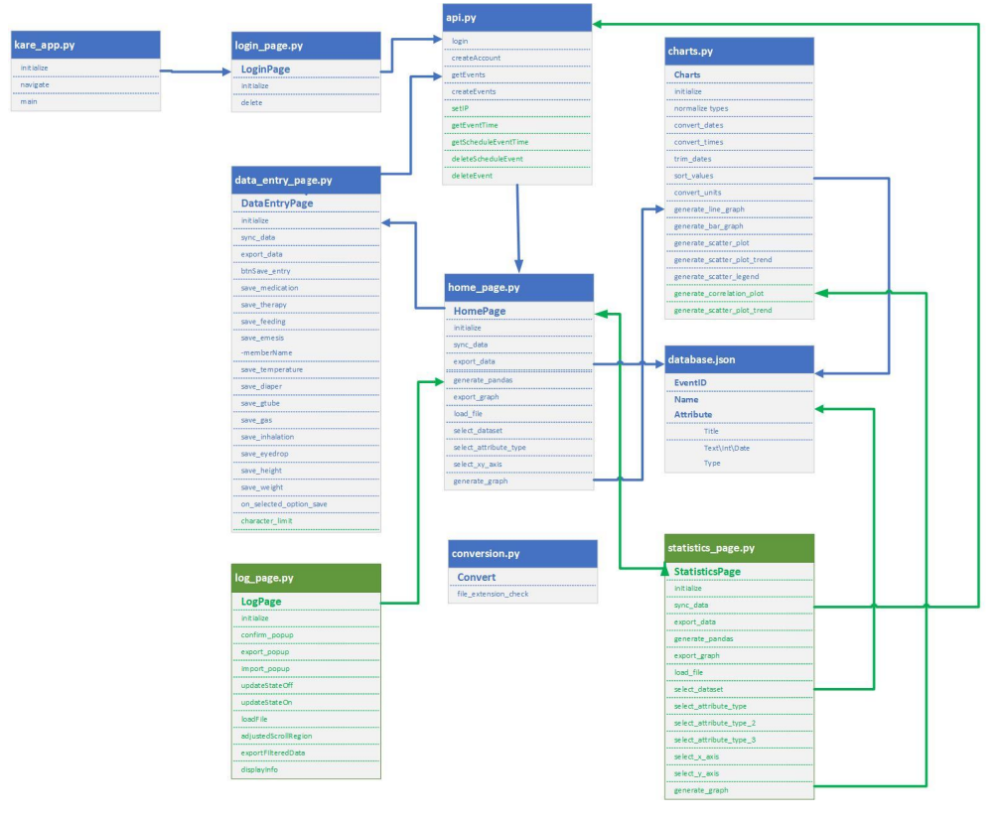
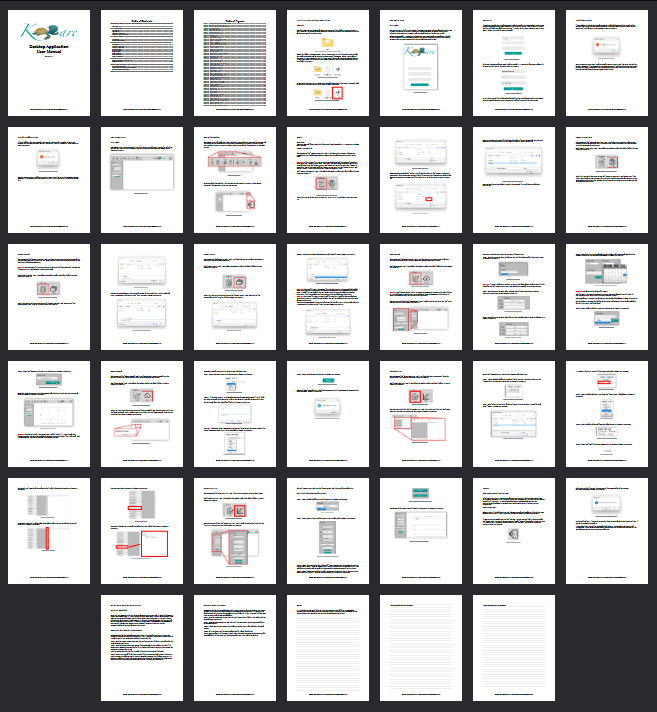

<header>
	<h1>Kare - Medical Charting Application</h1>
 

Easy to use at home medical charting system for medically complex children.
   

     

I worked on a small team to build new requirements for the desktop application.

 Please click the video lin below to see a brief demonstration.

<nav>

	    <a href="#requirements">Requirements</a> •
   	    <a href="#key-features">Key Features</a> •
            <a href="#user-manual">user Manual</a> 

</nav>

<section id="requirements">

  <h1>Requirements</h1>
  

	  <ul>
		  <li>Private Server - not virtual private (log-ins).</li>
		  <li>Add Log Charting functionality</li>
		  <li>Add More robust Data Visualization</li>
		  <li>Add Correlation and related Statistics</li>
		  <li>Make more friendly (think technology illiterate)</li>
		  <li>Test Cases and Recommendations</li>
		  <li>User Manual</li>
	  </ul>
  

   

     

   
</section>

<section id="key-features">
  <!-- Demonstration GIF -->
  <article>
    <h1>Key Features</h1>

 Meet Client Requirements for expanded features 

	  
- [x] Server Logins
- [x] Charting Functionality
- [x] Expand Data Visualization
- [x] Add Correlation and Statistics

Meet Engineering Requirments 

- [x] Test Cases
- [x] Recommendations
- [x] User Manual

  </article>
   
</section>

<section id="user-manual">
  <article>
    <h1>User Manual</h1>
    
The Kare Desktop User manual was a massive undertaking. Carefully designing the document with a completely technology naive user in mind is daunting. It was important to not leave anything to chance and explain every detail of the program to the target user. 

     

     
      
	     
The document covers and explains every software feature and even gives example of workflows to improve results and build confidence in the user.The final document is about 40 pages long.

         
	     

  </article>
   
</section>
